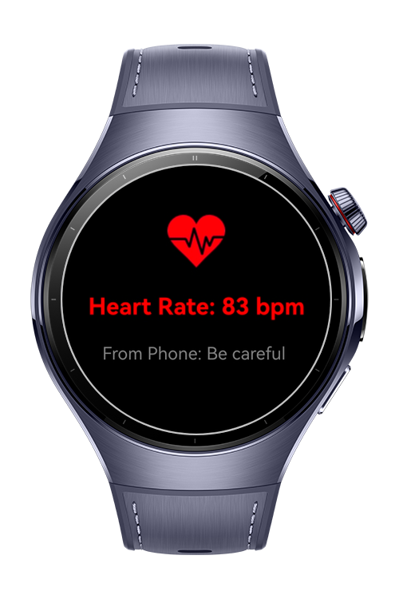

> **Note:** To access all shared projects, get information about environment setup, and view other guides, please visit [Explore-In-HMOS-Wearable Index](https://github.com/Explore-In-HMOS-Wearable/hmos-index).

# How to Get Heart Rate as Real Time with Sensor kit via Wear Engine for Android?
This app demonstrates an application that runs with **HarmonyOS Next** wearable devices. It enables seamless interaction between the wearable and a paired mobile device by combining real-time sensor data. Users can track their heart rate instantly, share it with their phone.

# Preview
<div>
   
</div>

# Use Cases

1) The user can measure the heart rate as real time with sensor.
2) The user can send the hear rate to the mobile app.

# Tech Stack

- **Languages**: ArkTS
- **Frameworks**: HarmonyOS SDK 5.1.0(18)
- **Tools**: DevEco Studio Vers 5.1.0.842
- **Libraries**:
    - `@kit.ArkUI`
    - `@kit.AbilityKit`
    - `@kit.PerformanceAnalysisKit`
    - `@kit.ArkTS`
    - `@kit.BasicServicesKit`
    - `@kit.WearEngine`
    - `@kit.SensorServiceKit`

# Directory Structure
   ```
entry/src/main/ets/
|---component
|---|---ButtonComponent
|---hiwearmainability
|---|---HiWearMainAbility
|---pages
|---|---Index
|---|---SendToPhone
|---utils
|---|---Constants
   ```

# Constraints and Restrictions
## Requirements
1) Configure signing settings. 
2) Change module.json with your phone app bundle name. 
3) Change the values on Constants.ets with your values. 
4) Change watch app bundle name with your bundle name.

## Supported Devices
- Huawei Watch 5
## Permissions
- ohos.permission.INTERNET
- ohos.permission.READ_HEALTH_DATA

# License
**Get Heart Rate as Real Time with Sensor kit via Wear Engine** is distributed under the terms of the MIT License
See the [LICENSE](./LICENSE) for more information.